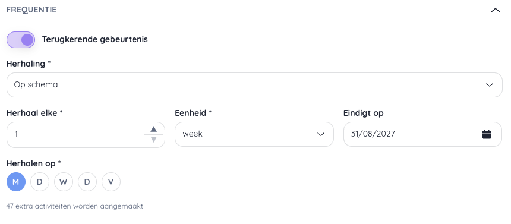
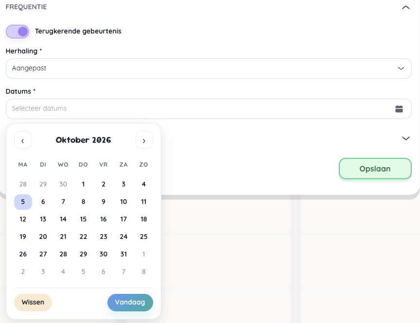

# Activiteiten aanmaken en bewerken

## Doelgroep bepalen

## Actviteit aanmaken

Een activiteit aanmaken kent drie onderdelen.

### Basisinformatie

### Herhaalde activiteit

Instellen dat een activiteit meerdere keren voorkomt doe je door te klikken op het frequentiepaneel en de toggle terugkerende gebeurtenis te activeren.
Een terugkerende gebeurtenis kan enkel maar worden aangemaakt als het veld Datum uit het paneel Basisinformatie werd ingevuld.

Onderaan wordt een indicatie gegeven van het aantal activiteiten dat zal worden aangemaakt. *Deze activiteiten worden als afzonderlijk activiteiten aangemaakt en moeten ook apart worden beheerd.
Een verandering aan 1 activiteit heeft geen invloed op de herhaalde activiteiten.*

**Herhaling op schema**

Een herhaling op schema betekent dat er een vast patroon is om de activiteit te laten herhalen.

- **Herhaal elke**: om de hoeveel tijd/keer moet de activiteit worden aangemaakt
- **Eenheid**: keuze tussen dag, week en maand
- **Eindigt op**: (Optioneel) de uiterlijke datum waarop de activiteit zal worden herhaald. Standaard is dit de laatste dag van het schooljaar.
- **Herhalen op**: De weekdag waarop de activiteit wordt gemaakt.

**Vrije data**

Een herhaling met aangepast schema laat je toe om vrij de dagen te kiezen waarop de activiteit moeten worden gedupliceerd.

### Bijlagen toevoegen
