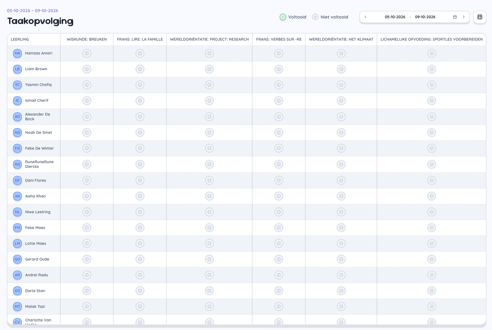

# Taakopvolging

## Overzicht

De taakopvolging stelt je in staat om op een interactieve en motiverende manier de leerlingen hun taken te laten afchecken.
Vooral in combinatie met een Prowise touchscreen, kan je de leerlingen zelf de handeling laten ondernemen. 

Het takenraster blokkeert de eerste rij en de eerste kolom zodat de namen van de leerlingen en de taken altijd zichtbaar blijven. 

Wanneer een leerling alle taken heeft afgerond voor de weergegeven periode volgt een festieve animatie 🎉

## Navigatiebalk

- **Legende**: voltooid en niet voltooid
- **Date picker**: de van en tot datum waarvoor de taken zichtbaar moeten zijn. In tegenstelling tot de weekplanner zijn de datums vrij in te geven en houdt dit geen rekening met de schoolweek. 
- **Weekplanner**: snelkoppeling om terug te navigeren naar het weekoverzicht. 

