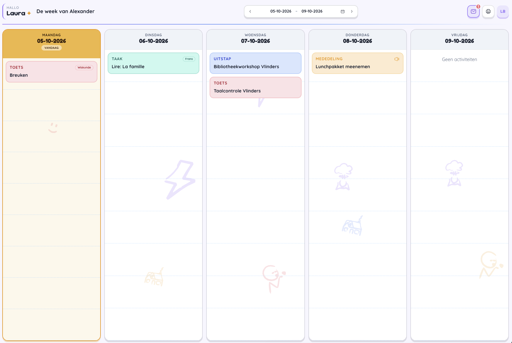
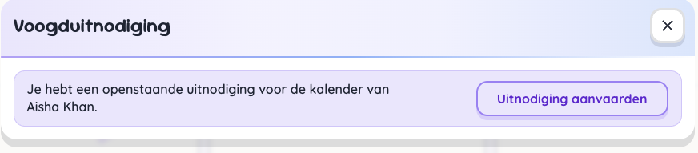
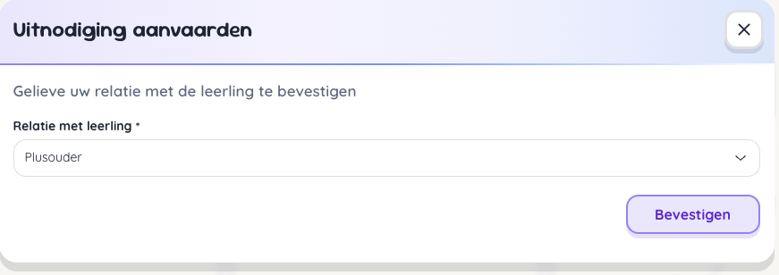

# Uitnodigingen

## Meerdere kinderen

Standaard wordt voor iedere leerling een uitnodiging verstuurd om toegang te krijgen tot KlasK. 
Heb je echter meerdere kinderen scholen die KlasK gebruiken, dan dien je je niet meer opnieuw te registreren via mail maar kan je in de applicatie zelf de uitnodiging aanvaarden.

In de navigatiebalk van de weekplanner staat er bij de actieknoppen een paars icoontje indien je een openstaande uitnodiging hebt.

Klikken op het icoontje opent een bevestigingsscherm. 

Na klikken op aanvaarden, dien je je relatie met de leerling te bepalen en te bevestigen.

De planning van de andere leerling wordt onmiddellijk geladen en is klaar om bekeken te worden. 

