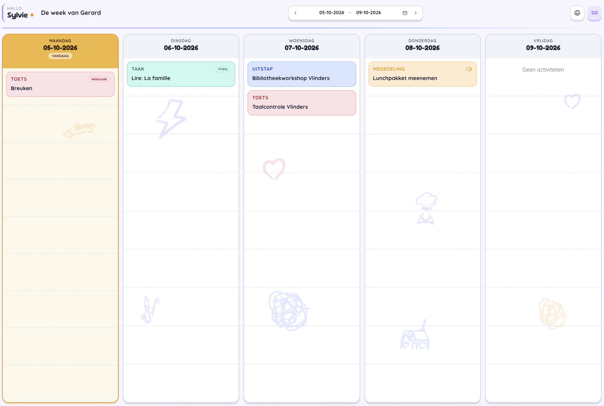
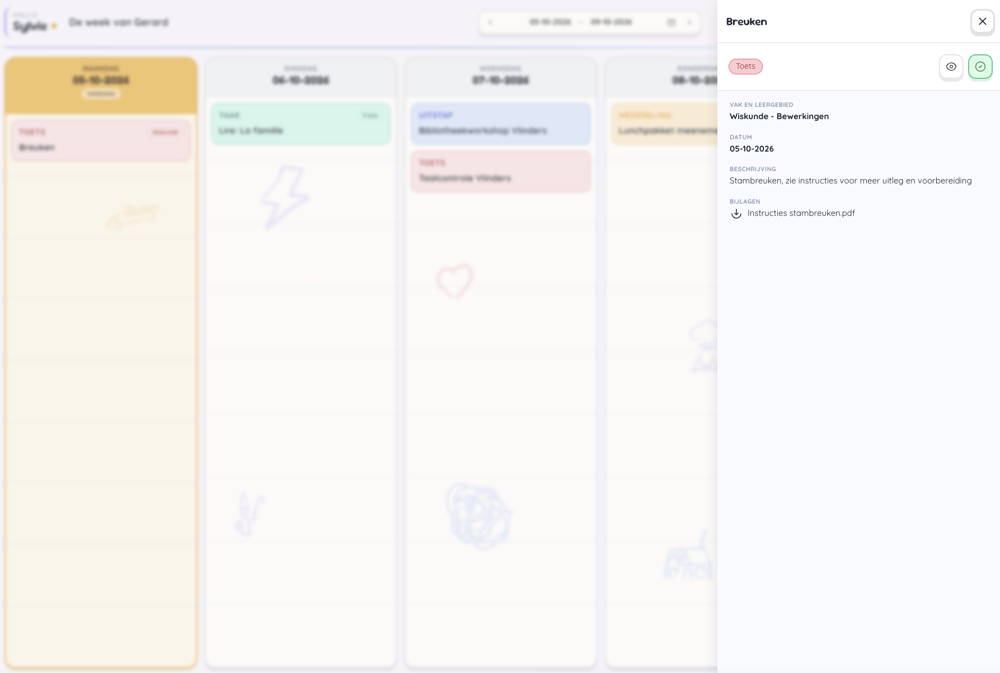
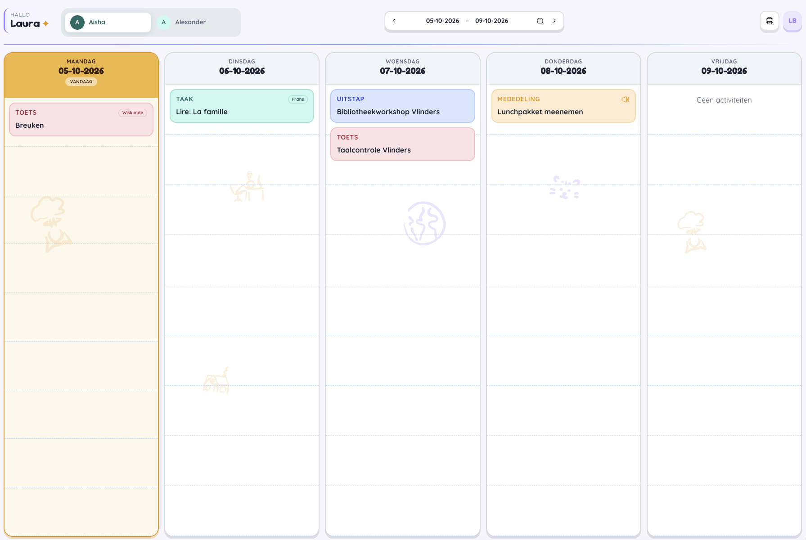

# Weekoverzicht

Veel van de functionaliteit in het weekoverzicht is hetzelfde ongeacht het aantal kinderen waarmee je gelinkt bent. 

## De weekplanner

### Navigatiebalk

- **Begroeting**
- De week van **"Leerling"**
- **Datumnavigatie**: Het overzicht is altijd de schoolweek en toont altijd vijf dagen (maandag tot en met vrijdag). Met de pijltjes kan je vlot navigeren naar een eerdere week of een week in de toekomst. Klikken op de het kalendertje brengt je terug naar de huidige week.
- **Print**: Het weekoverzicht kan afgedrukt worden. De selectie van de printopdracht is de actieve week in het overzicht. Je kan de planning afdrukken zoals je die ziet op het scherm of kiezen voor een eenvoudige lijstweergave.
- **Avatar**: Dit opent een contextmenu waar je meldingen ksn raadplegen en afmelden.

### Weekoverzicht

De dag van vandaag staat visueel aangeduid met een oker kleur.
In het overzicht kan je snel zien wat de leerling op die dag gepland heeft.

Elk type heeft een unieke kleurcode en het onderwerp van de activiteit. Optioneel kan de leerkracht ook het vak erbij vermelden.

- **Rood**: Toets
- **Groen**: Taak of huiswerk
- **Blauw**: Uitstap
- **Oker**: Mededeling

#### Activiteit openen

Door te klikken op een activiteit, opent aan de rechterzijde van het scherm een detail overzicht.

**Algemene Informatie:**

Bovenaan wordt de titel van de activiteit getoond en heb je een knop om dit overzicht terug te sluiten.
Dan zie je over welk type activiteit het gaat (toets/taak/mededeling/uitstap) en heb je twee actieknoppen (de acties zijn optioneel uit te voeren):
- **Gezien**: Ik heb de activiteit gezien en ben op de hoogte
- **Voltooid**: Ik bevestig dat de activiteit werd uitgevoerd/voorbereid door de leerling

**Detail velden:**

- **Vak en leergebied**
- **Datum**: de datum waatop de activiteit plaatsvindt of de datum waartegen de activiteit moet worden voltooid.
- **Beschrijving**: Optioneel. Extra informatie over de activiteit.
- **Bijlagen**: Optioneel. De leerkrachten kunnen bijlagen toevoegen. Klikken op de link zal de bijlage downloaden naar jouw computer. Zo weet de leerling altijd wat er moet worden gestudeerd en heeft hij/zij altijd toegang tot het huiswerk of de taak.

### Overzicht meerdere leerlingen

In geval je gekoppeld bent aan meerdere leerlingen, zal je in de navigatiebalk de mogelijkheid hebben om direct te wisselen tussen de overzichten van de leerlingen. 

